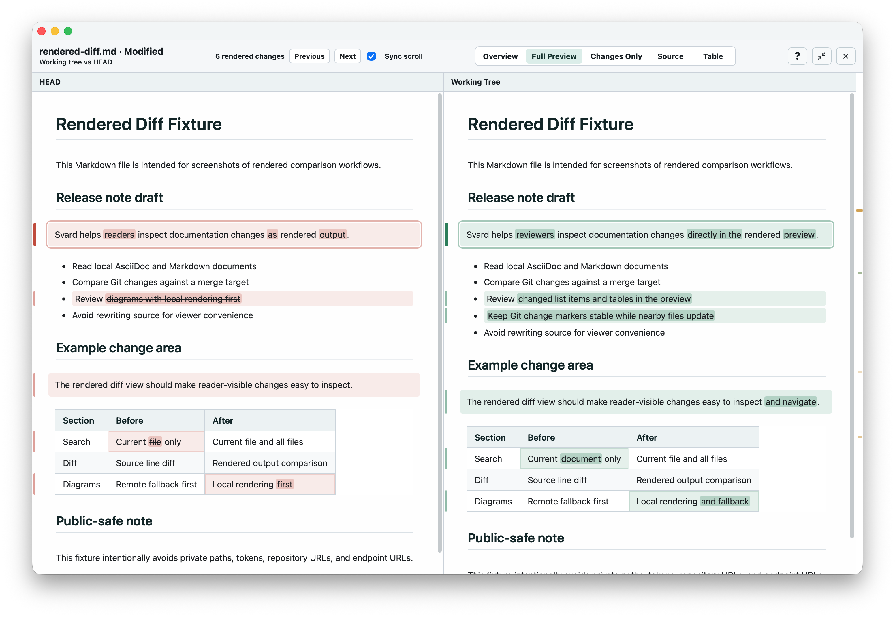

# Svard

Svard (Specification Viewer and Rendered Diff) is a desktop review environment for verifying changes that AI agents make across many technical documents. It keeps rendered output, change locations, and the base or comparison source together so people can understand what changed without relying on raw source diffs alone.

Svard renders Markdown and AsciiDoc before comparing reader-visible changes across prose, lists, tables, diagrams, and source views. All Diffs, Rendered Diff, Change Review Mode, and Revision Lens support a review flow that moves from the changed document set to a specific comparison with its Base.

The normal rendering path is local-first. Svard does not run an AI agent, call an LLM, or send documents to an AI service; it reviews changes that already exist in local files or Git comparisons.



## Website

Product overview, features, and download notes are available at:

https://yyamamot.github.io/Svard/

## Features

- Review changes across many documents with All Diffs, Rendered Diff, Change Review Mode, and Revision Lens
- Keep rendered output, change locations, and the Base or comparison source in the same review flow
- Local rendering for Markdown, AsciiDoc, Mermaid, PlantUML, and Graphviz-oriented workflows
- Kroki support only as an explicit fallback path for unsupported or compatibility-focused diagrams
- Browser-like reading with tabs, history, recently closed documents, quick open, split view, and find-in-page
- Rendered diff views for Markdown / AsciiDoc documents, including reader-visible prose, lists, tables, diagrams, and source views
- Privacy-focused review and runtime artifacts that avoid storing source text, diagram source, private absolute paths, or repository roots by default

PlantUML local rendering is based on the official `@plantuml/core` TeaVM browser build. Kroki remains an explicit fallback for diagrams that need compatibility beyond the bundled local renderer.

## Development

Requirements:

- Node.js 24 LTS
- pnpm 10
- Rust stable

Common checks:

```bash
pnpm install
pnpm run typecheck
pnpm run lint
pnpm run test:unit
pnpm run tauri:check
```

Run the web harness:

```bash
pnpm run dev:web
```

Run the Tauri app:

```bash
pnpm run dev:tauri
```

## Acknowledgements

Svard takes inspiration from [Arto](https://github.com/arto-app/Arto) in its emphasis on local-first document reading and quiet desktop viewer workflows.

The bundled PlantUML browser renderer is based on the official [`@plantuml/core`](https://www.npmjs.com/package/@plantuml/core) TeaVM build. Kroki is supported only as an explicit fallback path. See [Third-Party Notices](THIRD_PARTY_NOTICES.md) for bundled runtime notices.
